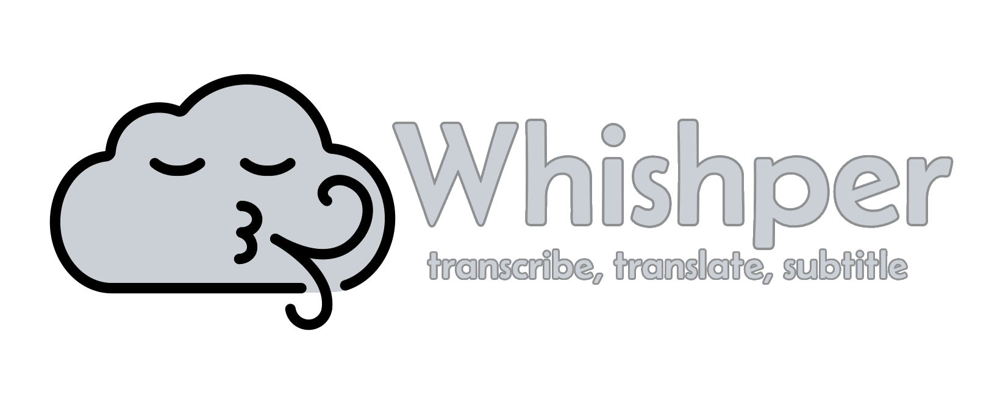

**Whishper** is an open-source, 100% local audio transcription and subtitling suite with a full-featured web UI.

## Features

- [x] 🗣️ **Transcribe any media** to text: audio, video, etc.
  - Transcribe from URLs (any source supported by yt-dlp).
  - Upload a file to transcribe.
- [x] 📥 **Download transcriptions in many formats**: TXT, JSON, VTT, SRT or copy the raw text to your clipboard.
- [x] 🌐 **Translate your transcriptions** to any language supported by [Libretranslate](https://libretranslate.com).
- [x] ✍️ **Powerful subtitle editor** so you don't need to leave the UI!
  - Transcription highlighting based on media position.
  - CPS (Characters per second) warnings.
  - Segment splitting.
  - Segment insertion.
  - Subtitle language selection.
- [x] 🏠 **100% Local**: transcription, translation and subtitle edition happen 100% on your machine (can even work offline!).
- [x] 🚀 **Fast**: uses FasterWhisper as the Whisper backend: get much faster transcription times on CPU!
- [x] 👍 **Quick and easy setup**: use the quick start script, or run through a few steps!
- [x] 🔥 **GPU support**: use your NVIDIA GPU to get even faster transcription times!
- [x] 🐎 **CPU support**: no GPU? No problem! Whishper can run on CPU too.

### Roadmap

- [ ] Local folder as media input ([#15](https://github.com/pluja/whishper/issues/15)).
- [ ] Full-text search all transcriptions.
- [ ] User authentication.
- [ ] Audio recording from the browser.
- [ ] Add [insanely-fast-whisper](https://github.com/Vaibhavs10/insanely-fast-whisper) as an optional backend ([#53](https://github.com/pluja/whishper/issues/53)).
- [x] ~~Support for GPU acceleration.~~
  - [ ] Non NVIDIA GPU support. Is it possible with faster-whisper?
- [ ] Can we do something with [seamless_communication](https://github.com/facebookresearch/seamless_communication)?

## Project structure

Whishper is a collection of pieces that work together. The three main pieces are:

- Transcription-API: This is the API that enables running Faster-Whisper. You can find it in the `transcription-api` folder.
- Whishper-Backend: This is the backend that coordinates frontend calls, database, and tasks. You can find it in `backend` folder.
- Whishper-Frontend: This is the frontend (web UI) of the application. You can find it in `frontend` folder.
- Translation (3rd party): This is the libretranslate container that is used for translating subtitles.
- MongoDB (3rd party): This is the database that stores all the information about your transcriptions.
- Nginx (3rd party): This is the proxy that allows running everything from a single domain.

### Contributing

Contributions are welcome! Feel free to open a PR with your changes, or take a look at the issues to see if there is something you can help with.

### Development setup

Check out the development documentation [here](https://whishper.net/guides/develop/).

## Screenshots

These screenshots are available on [the official website](https://whishper.net/usage/transcriptions/), click any of the following links to see:

- [A transcription creation](https://whishper.net/usage/transcriptions/)
- [A transcription translation](https://whishper.net/usage/translate/)
- [A transcription download](https://whishper.net/usage/download/)
- [The subtitle editor](https://whishper.net/usage/editor/)

## Support

- [Monero](https://www.getmonero.org/): `82x6cn628oTUXV63DxBd6MJB8d997FhaSaGFvoWMgwihVmgiXYQPAwm2BCH31AovA9Qnnv1qQRrJk83TaJ8DaSZU2zkbWfM`
- [Bitcoin](https://bitcoin.org/en/): `bc1qfph44jl4cy03stwfkk7g0qlwx2grldr9xpk086`
- [Lightning Network (kycnotme)](https://getalby.com/p/kycnotme)

## Star History

<a href="https://star-history.com/#pluja/whishper&Date">
  <picture>
    <source media="(prefers-color-scheme: dark)" srcset="https://api.star-history.com/svg?repos=pluja/whishper&type=Date&theme=dark" />
    <source media="(prefers-color-scheme: light)" srcset="https://api.star-history.com/svg?repos=pluja/whishper&type=Date" />
    
  </picture>
</a>

## Credits

- [Faster Whisper](https://github.com/guillaumekln/faster-whisper)
- [LibreTranslate](https://github.com/LibreTranslate/LibreTranslate)
